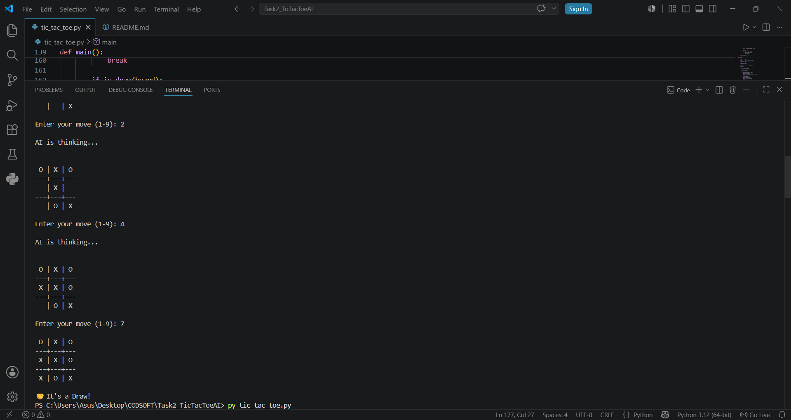
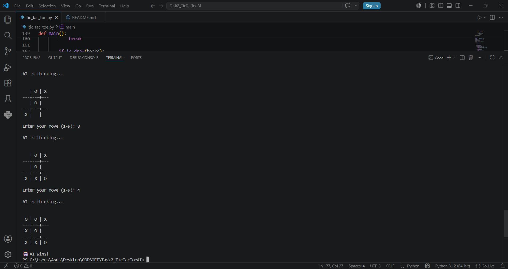

# Tic-Tac-Toe AI

## Overview

This project is an AI-powered Tic-Tac-Toe game developed using Python as part of the CodSoft Artificial Intelligence Internship.

The game allows a human player to compete against an AI opponent. The AI uses the Minimax Algorithm to make optimal decisions, making it impossible to defeat.

## Features

* Human vs AI gameplay
* Unbeatable AI using Minimax Algorithm
* Winner detection
* Draw detection
* Input validation
* Interactive command-line interface

## Technologies Used

* Python 3

## AI Algorithm

The project uses the Minimax Algorithm, a decision-making algorithm commonly used in game theory and artificial intelligence.

The AI evaluates all possible future game states and selects the move that maximizes its chances of winning while minimizing the opponent's chances.

## Project Structure

Task2_TicTacToeAI

├── tic_tac_toe.py

├── README.md

└── screenshots

## How to Run

1. Open terminal
2. Navigate to the project folder
3. Run:

python tic_tac_toe.py
---------or---------
py tic_tac_toe.py

## Learning Outcomes

* Artificial Intelligence fundamentals
* Game Theory
* Minimax Algorithm
* Python programming
* Problem-solving and decision-making algorithms

## Screenshots

### Start Screen

### AI Move

### AI Wins

## Author

Pranav Sagar