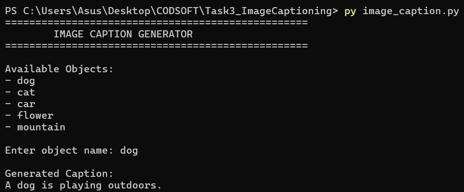
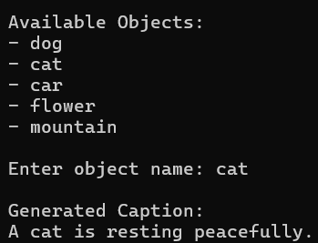

# Image Caption Generator

## Overview

This project is a simple Image Caption Generator developed using Python as part of the CodSoft Artificial Intelligence Internship.

The system generates meaningful captions for different image/object categories such as dogs, cats, cars, flowers, and mountains.

## Features

- Object-based caption generation
- User-friendly command-line interface
- Multiple captions for each object
- Random caption selection
- Easy to understand and use

## Technologies Used

- Python 3

## Project Structure

Task3_ImageCaptioning

├── image_caption.py

├── README.md

└── screenshots

## How to Run

1. Open terminal
2. Navigate to the project folder
3. Run:

py image_caption.py

## Available Objects

- Dog
- Cat
- Car
- Flower
- Mountain

## Sample Output

Enter object name:

dog

Generated Caption:

A cute dog is sitting on the grass.

## Working Principle

1. User selects an object category.
2. The program checks whether the object exists.
3. A caption is randomly selected from predefined captions.
4. The generated caption is displayed to the user.

## Learning Outcomes

- Python programming
- Dictionaries and lists
- Random module
- Text generation concepts
- Image captioning fundamentals

## Screenshots

### Start Screen

### Object Selection

### Generated Caption

## Author

Pranav Sagar