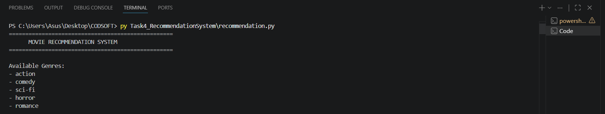
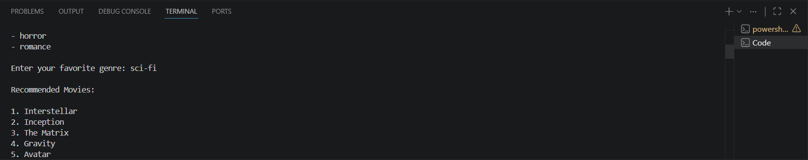

# Movie Recommendation System

## Overview

This project is a simple Movie Recommendation System developed using Python as part of the CodSoft Artificial Intelligence Internship.

The system recommends movies to users based on their preferred genre.

## Features

- Genre-based movie recommendations
- User-friendly interface
- Multiple movie categories
- Fast recommendations
- Input-based suggestions

## Available Genres

- Action
- Comedy
- Sci-Fi
- Horror
- Romance

## Technologies Used

- Python 3

## Project Structure

Task4_RecommendationSystem

├── recommendation.py

├── README.md

└── screenshots

## How to Run

1. Open terminal
2. Navigate to project folder
3. Run:

python recommendation.py
--------or--------
py recommendation.py

## Sample Usage

Enter your favorite genre:

sci-fi

Recommended Movies:

1. Interstellar
2. Inception
3. The Matrix
4. Gravity
5. Avatar

## Learning Outcomes

- Python programming
- Conditional statements
- Dictionaries
- User input handling
- Recommendation system basics

## Screenshots

### Start Screen

### Genre Selection and Recommendations

## Author

Pranav Sagar